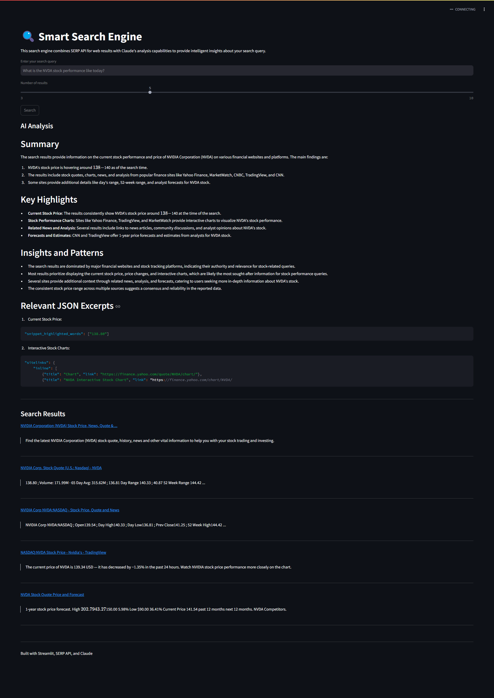

# Smart Search Engine 🔍

A powerful search engine that combines SERP API for web results with Claude's AI analysis capabilities to provide intelligent insights about your search queries.

## Features

- Web search functionality powered by SERP API
- AI-powered analysis of search results using Claude
- Clean and intuitive Streamlit interface
- Customizable number of search results
- Markdown-formatted AI insights
- Direct links to search results with snippets

## Prerequisites

- Python 3.8+
- SERP API key
- Claude API key

## Installation

1. Clone the repository
2. Create a `.env` file and add your API keys
3. Install the dependencies
4. Run the app with `streamlit run app.py`

